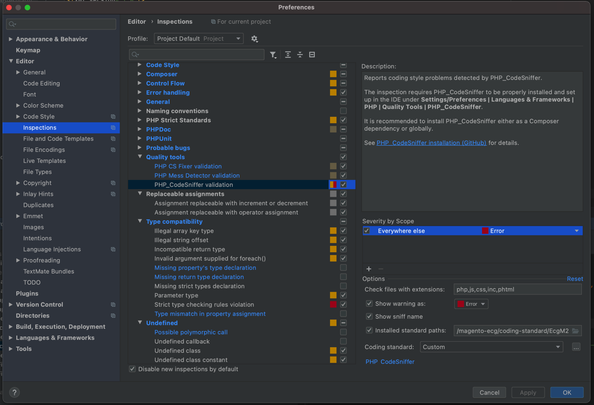

# ECG Magento Code Sniffer Coding Standard

[](https://insight.sensiolabs.com/projects/a06c37c6-0d79-4476-aff5-12d8ce1d8c53)

ECG Magento Code Sniffer Coding Standard is a set of rules and sniffs for [PHP_CodeSniffer](https://github.com/squizlabs/PHP_CodeSniffer) tool.

It allows automatically check your code against some of the common Magento and PHP coding issues, like:
- raw SQL queries;
- SQL queries inside a loop;
- direct instantiation of Mage and Enterprise classes;
- unnecessary collection loading;
- excessive code complexity;
- use of dangerous functions;
- use of PHP Superglobals;

and many others.

Both Magento and Magento 2 are supported.

# Installation

Before starting using our coding standard install [PHP_CodeSniffer](https://github.com/squizlabs/PHP_CodeSniffer).

The recommended installation method for PHPCS is globally with Composer:
```sh
composer global require "squizlabs/php_codesniffer=*"
```
Make sure Composer's bin directory (defaulted to `~/.composer/vendor/bin/`) is in your PATH.

Clone or download this repo somewhere on your computer or install it with [Composer](http://getcomposer.org/):

```sh
composer require magento-ecg/coding-standard
```

___

Note: PHP_CodeSniffer 3.x is now required to run our coding standard. To install PHP_CodeSniffer 2.x compatible version:

```sh
composer require magento-ecg/coding-standard:4.*
```

Add the ECG standards directory to PHP_CodeSniffer's installed paths:
```sh
$ ./vendor/bin/phpcs --config-set installed_paths /path/to/your/folder/vendor/magento-ecg/coding-standard
```

You can check Installation by running following command:

```
$ ./vendor/bin/phpcs -i
```
It should do the following output:
```
The installed coding standards are EcgM2, PEAR, Zend, PSR2, MySource, Squiz, PSR1, PSR12 and Magento2
```


# Usage CLI Tool 

Select a standard to run with CodeSniffer: EcgM2 for Magento 2

Run CodeSniffer:

```sh
$ ./vendor/bin/phpcs --standard=EcgM2,PSR2,Magento2 /path/to/code
```

This package is compatible with Composer Installer Plugins for PHPCS coding standards (such as https://github.com/Dealerdirect/phpcodesniffer-composer-installer) and can be automatically registered with PHPCS during installation.

To check design templates, you must specify `phtml` in the `--extensions` argument: `--extensions=php,phtml`


# Usage Hook pre-commit 

Get hook file from the existing repository.
```sh
$ /path/to/your/folder/vendor/magento-ecg/coding-standard/.githooks
```

Install Hooks on the project. Copy hook into the project GIT folder
```
cp -R ./vendor/magento-ecg/coding-standard/.githooks ./
```

To automate hooks installation for all developers, it needs to include the following lines into your project's composer.json
```
    "scripts": {
        "post-install-cmd": [
            "git config core.hooksPath .githooks"
        ],
        "post-update-cmd": [
            "git config core.hooksPath .githooks"
        ]
    }
```

Run composer install to refresh the project state.
```
composer install
```

You are done!
Now, each product commit will be validated for an alignment with Magento Coding Standards. 


# Usage PHPStorm

PhpStorm provides code style check through integration with the PHP Code Sniffer tool, 
which validates your code for consistency with a coding standard and best practices.

Once Tool installed and configured in PhpStorm, the tool is available in any opened PHP file. 
Errors and warnings reported by PHP Code Sniffer on-the-fly are displayed as popup messages. 

Install coding standard for development
_See Installation steps._

**Configure PhpStorm**
* Open Preference: "Settings > Preferences > Editor > Inspections > PHP > Quality Tools".
* Choose "PHP_CodeSniffer validation" option.
* It is ok to configure everything under the scope "Everything else":
* In the "Check files with extensions" field, provide the comma-separated list of file extensions that should be checked by PHP Code Sniffer: php, js, phtml.
* Installed standard path should be checked and selected project path 
```
/path/to/your/folder/vendor/magento-ecg/coding-standard
```
* Choose installed coding standard path as the main for standards
* Select "EcgM2" or "Custom" it the "Coding standard" list.



https://www.jetbrains.com/help/phpstorm/using-php-code-sniffer.html#installing-configuring-code-sniffer

Note: We would also suggest enabling PHP Mess Detector validation as well.
Note: in case of using a Docker or VM, It needs to configure new PHPCS CLI Interpreter which will point out to VM/Docker.


# Requirements

PHP 5.4 and up.

Checkout the `php-5.3-compatible` branch to get the PHP 5.3 version.

# Contribution

Please feel free to contribute new sniffs or any fixes or improvements for the existing ones.
